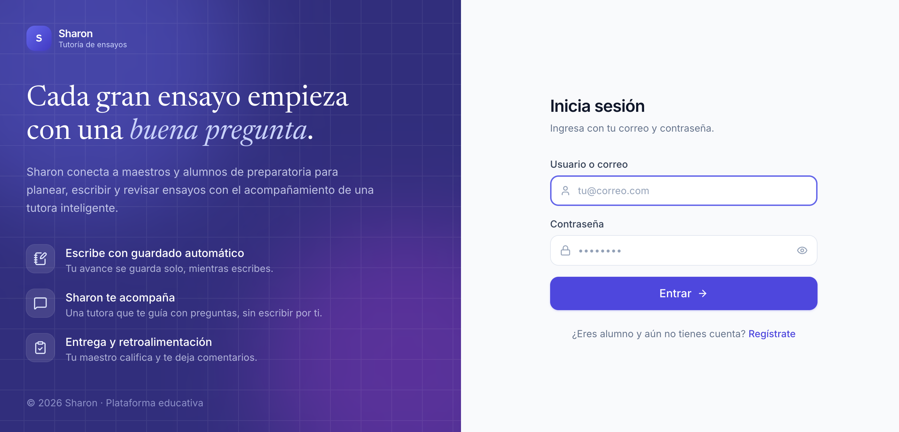
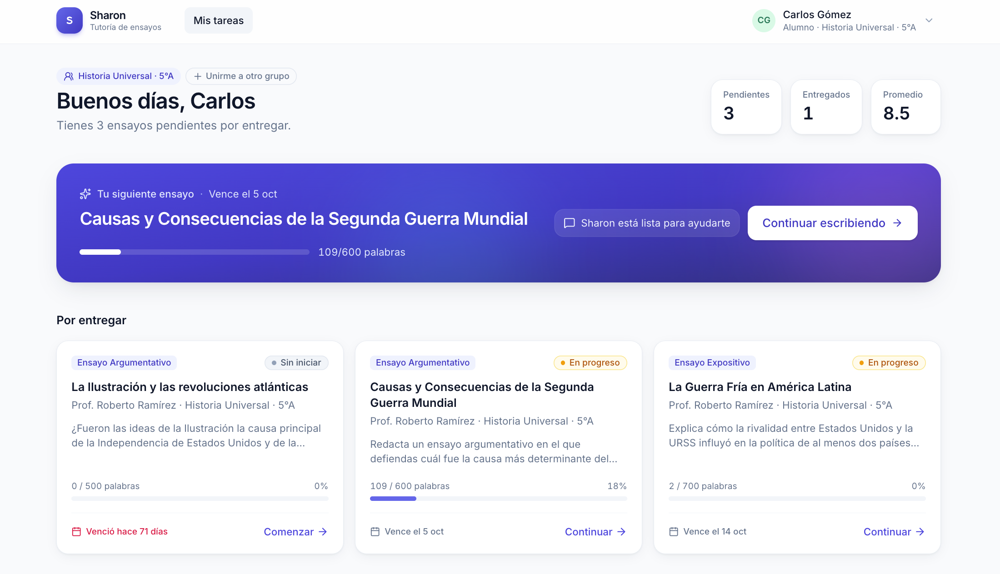
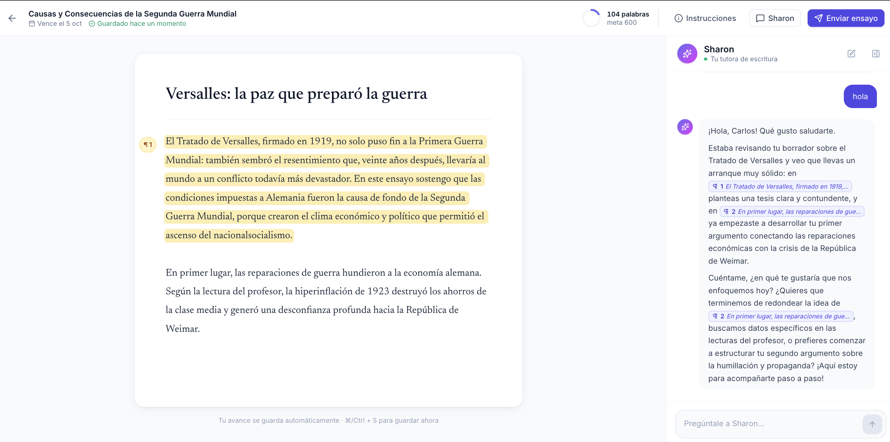

# Sharon - Plataforma de Tutoría de Ensayos para Preparatoria

Plataforma inteligente que conecta a profesores y estudiantes de preparatoria mediante agentes de inteligencia artificial construidos con **Google Agent Development Kit (ADK)**, bases de datos **PostgreSQL**, almacenamiento de documentos en **Google Cloud Storage (GCS)** y recuperación de información **RAG en Vertex AI Search**.

## Capturas de Pantalla

### Inicio de sesión



### Panel principal



### Tutor de ensayos



## Estructura del Repositorio

```text
.
├── backend/    # Backend con Google ADK, PostgreSQL, RAG y arquitectura multiagente
└── frontend/   # Interfaz web en React para maestros y alumnos
```

## Inicio Rápido

```bash
cd frontend
cp .env.example .env   # pon en VITE_API_TARGET la URL de `make -C ../backend url`
npm install
npm run dev
```

Accede a `http://localhost:5173` (admin: `admin@gmail.com`, maestro: `teacher@gmail.com`, alumno: `user@gmail.com`). Los alumnos nuevos se registran en `/registro` y se unen a un grupo con la clave que les da su maestro.